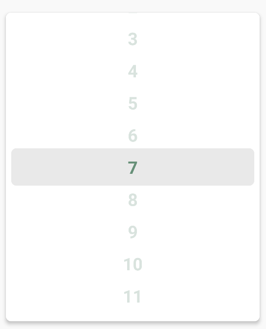

<h1 align="center">WheelPicker</h1>

<p align="center">
    
    
    
</p>
<p align="center">
    
</p>
<p align="center">Customizable Android picker view library.</p>

WheelPicker is an Android library that contains customizable wheel picker view, usable for Android XML
View and Jetpack Compose. There are some picker views in Android like NumberPicker or material pickers.
But if you need other style, that is boring.

This picker is developed for customizing picker. You can style picker with custom item view, indicator
and other decorations. And in the future, effect and animation customizing API will be added. (Currently planed)

**Note: This library is under the huge refactoring.**

## Installation

Prerequisites:
- Android SDK 21 or higher.
- JDK version 8 or higher.

This library is published to Maven Central. You can just install it like following:

```groovy
repositories {
    mavenCentral()
}

dependencies {
    implementation("io.woong.wheelpicker:wheelpicker:${version}")
    implementation("io.woong.wheelpicker:wheelpicker-compose:${version}")
}
```

## Getting Started

### Android View

Pickers of this library are working with 2 components. The view itself and the adapter.
To draw picker in your layout, place `ValuePickerView` into layout.

```xml
<io.woong.wheelpicker.ValuePickerView
    android:id="@+id/picker"
    android:layout_width="match_parent"
    android:layout_height="match_parent" />
```

After that, you should create an adapter for this picker view. The adapter must inheritances
`ValuePickerAdapter`. The below example code is using view binding.

```kotlin
class ExamplePickerAdapter : ValuePickerAdapter<Int, View>() {
    override fun createItemView(parent: ViewGroup): View {
        val inflater = LayoutInflater.from(parent.context)
        return inflater.inflate(R.layout.example_item_view, parent, false)
    }

    override fun bindItemView(itemView: View, position: Int) {
        val value = getValue(position)
        itemView.findViewById<AppCompatTextView>(R.id.valueText).text = value.toString()
    }
}
```

After implementing `ValuePickerAdapter`, you should set adapter to picker view.

```kotlin
val picker = findViewById<ValuePickerView>(R.id.picker)
val adapter = ExamplePickerAdapter()
adapter.values = listOf(1, 2, 3, 4, 5, 6, 7, 8, 9, 10)
picker.adapter = adapter
```

### Jetpack Compose

This library provides Jetpack Compose version of picker. To use picker in Jetpack Compose, place
`ValuePicker` composable into layout.

```kotlin
ValuePicker(
    values = listOf(1, 2, 3, 4, 5, 6, 7, 8, 9, 10),
    modifier = Modifier.fillMaxSize().height(120.dp)
) { value ->
    Box(
        modifier = Modifier.fillMaxSize(),
        contentAlignment = Alignment.Center,
    ) {
        BasicText(text = "$value")
    }
}
```

## License

Copyright 2023 Jaeung Cheon.

This project is licensed under the Apache License Version 2.0.
See [License file](./LICENSE.txt) for more details.
